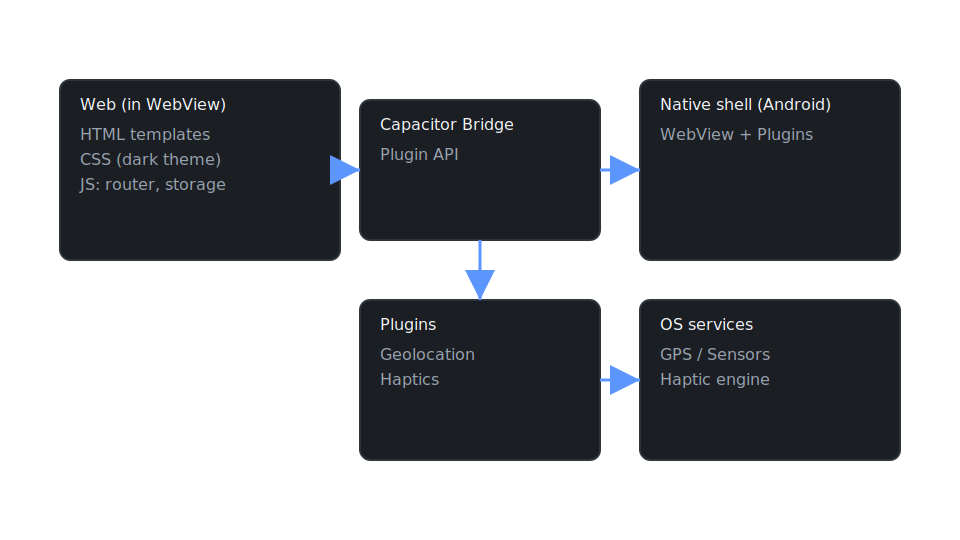

# From Zero to Mobile: Web + Capacitor

- Fresh macOS to a running Android app
- Plain HTML/CSS/JS + tiny router
- Capacitor: Geolocation + Haptics

---

## What we'll build

- Dark start screen (templates + CSS)
- Do Action → fullscreen circle zoom
- Get Location → GPS + haptics
- Settings → localStorage persistence

---

## Architecture overview



---

## Setup (macOS)

1. Xcode Command Line Tools: `xcode-select --install`
2. Homebrew
3. nvm + Node >= 20 (we use 22)
4. Java 21 via Homebrew
5. Android Studio + SDKs

---

## Project structure

```
www/
  index.html
  css/styles.css
  js/
    storage.js
    capacitor-bridge.js
    router.js
    app.js
```

---

## Running the app

```bash
source ~/.nvm/nvm.sh && nvm use 22
npm install
npm install @capacitor/core @capacitor/cli @capacitor/android \
  @capacitor/geolocation @capacitor/haptics
npx cap sync android
npx cap open android
```

---

## Code tour: templates + router

- index.html contains `<template id="tpl-start">`, `tpl-about`, `tpl-settings`
- router maps `#hash` → template id
- After render, bind events per screen

---

## Capacitor bridge

- Geolocation: GPS (with browser fallback)
- Haptics: vibrate on click/success
- Graceful degradation on web

---

## Resources

**HTML / CSS / JavaScript:**
- [MDN Web Docs](https://developer.mozilla.org/) - Comprehensive web standards reference
- [HTML `<template>` element](https://developer.mozilla.org/en-US/docs/Web/HTML/Element/template)
- [CSS Custom Properties](https://developer.mozilla.org/en-US/docs/Web/CSS/Using_CSS_custom_properties)

**Capacitor:**
- [Capacitor Docs](https://capacitorjs.com/docs) - Official documentation
- [Geolocation Plugin](https://capacitorjs.com/docs/apis/geolocation)
- [Haptics Plugin](https://capacitorjs.com/docs/apis/haptics)
- [Plugin Index](https://capacitorjs.com/docs/plugins) - Community & official plugins